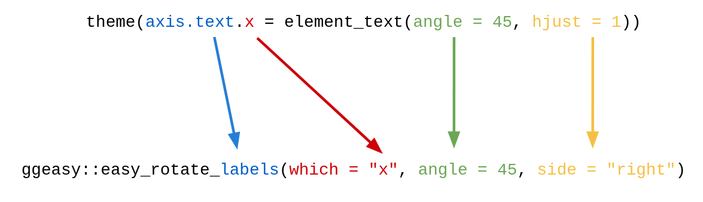
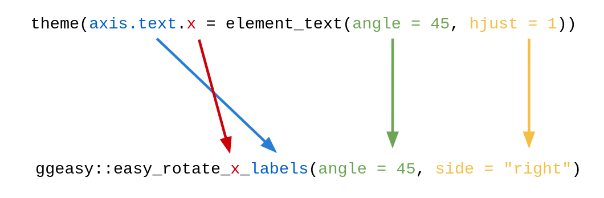

```{r setup, include=FALSE}
options(htmltools.dir.version = FALSE)
options(servr.daemon = TRUE)
options(DT.options = list(bPaginate = FALSE, fillContainer = TRUE, searching = FALSE, pageLength = 10, scrollY = 350))
htmltools::tagList(rmarkdown::html_dependency_font_awesome())
xaringanExtra::use_animate_css()
# knitr::opts_chunk$set(eval = FALSE)
library(ggplot2)
```

# Background

{ggplot2}

> ggplot2 is a system for declaratively creating graphics, based on The Grammar of Graphics. You provide the data, tell ggplot2 how to map variables to aesthetics, what graphical primitives to use, and it takes care of the details.

.pull-right[
 -- `?ggplot2`
]

--

<br />

Implementing the Grammar of Graphics has been transformative for visualisations in R.

--

<br />

It has helped countless users truly think about how to craft visual representations of their data.

---

# Default theme()

The default `theme()` for `ggplot2` is reasonable, but it's probably not exactly what you want

--

.pull-left[
```{r default theme code, eval = FALSE}
ggplot(mtcars) + 
  aes(mpg, hp) +
  geom_point() + 
  geom_smooth()
```
]

.pull-right[
```{r default theme plot, echo = FALSE, message = FALSE, out.height="450px"}
ggplot(mtcars) +
  aes(mpg, hp) +
  geom_point() +
  geom_smooth() 
```
]

---

# ggplot2::theme()

ggplot2::theme()

> Themes are a powerful way to customize the non-data components of your plots: i.e. titles, labels, fonts, background, gridlines, and legends. Themes can be used to give plots a consistent customized look. 

.pull-right[
 -- `?ggplot2::theme`
]

---

# ggplot2::theme()

There are ... lots of arguments
--
.pull-left[
```{r, theme(), eval = FALSE}
theme(
  line,
  rect,
  text,
  title,
  aspect.ratio,
  axis.title,
  axis.title.x,
  axis.title.x.top,
  axis.title.x.bottom,
  axis.title.y,
  axis.title.y.left,
  axis.title.y.right,
  axis.text,
  axis.text.x,
  axis.text.x.top,
  axis.text.x.bottom,
  axis.text.y,
  axis.text.y.left,
  axis.text.y.right,
```
]

.pull-right[
```{r, theme()2, eval = FALSE}
  axis.ticks,
  axis.ticks.x,
  axis.ticks.x.top,
  axis.ticks.x.bottom,
  axis.ticks.y,
  axis.ticks.y.left,
  axis.ticks.y.right,
  axis.ticks.length,
  axis.ticks.length.x,
  axis.ticks.length.x.top,
  axis.ticks.length.x.bottom,
  axis.ticks.length.y,
  axis.ticks.length.y.left,
  axis.ticks.length.y.right,
```
]

---
class: animated flipInY

# ggplot2::theme()  (...continued)

.pull-left[
```{r, theme()3, eval = FALSE}
  axis.line,
  axis.line.x,
  axis.line.x.top,
  axis.line.x.bottom,
  axis.line.y,
  axis.line.y.left,
  axis.line.y.right,
  legend.background,
  legend.margin,
  legend.spacing,
  legend.spacing.x,
  legend.spacing.y,
  legend.key,
  legend.key.size,
  legend.key.height,
  legend.key.width,
  legend.text,
  legend.text.align,
  legend.title,
  legend.title.align,
```
]

.pull-right[
```{r, theme()4, eval = FALSE}
  legend.position,
  legend.direction,
  legend.justification,
  legend.box,
  legend.box.just,
  legend.box.margin,
  legend.box.background,
  legend.box.spacing,
  panel.background,
  panel.border,
  panel.spacing,
  panel.spacing.x,
  panel.spacing.y,
  panel.grid,
  panel.grid.major,
  panel.grid.minor,
  panel.grid.major.x,
  panel.grid.major.y,
  panel.grid.minor.x,
  panel.grid.minor.y,
  panel.ontop,
```
]

---
class: animated flipInY

# ggplot2::theme()  (...continued again)

.pull-left[
```{r, theme()5, eval = FALSE}
  plot.background,
  plot.title,
  plot.title.position,
  plot.subtitle,
  plot.caption,
  plot.caption.position,
  plot.tag,
  plot.tag.position,
  plot.margin,
  strip.background,
  strip.background.x,
  strip.background.y,
  strip.placement,
  strip.text,
  strip.text.x,
  strip.text.y,
  strip.switch.pad.grid,
  strip.switch.pad.wrap,
  ...,
  complete = FALSE,
  validate = TRUE
)
```
]

.pull-right[
Phew!
]

---

# ggplot2::theme_bw()

There are "shortcuts" to some alternative themes

--

.pull-left[
```{r theme_bw code, eval = FALSE}
ggplot(mtcars) +
  aes(mpg, hp) +
  geom_point() + 
  geom_smooth() + 
* theme_bw()
```
]

.pull-right[
```{r theme_bw plot, echo = FALSE, message = FALSE, out.height="450px"}
ggplot(mtcars) + 
  aes(mpg, hp) + 
  geom_point() +
  geom_smooth() + 
  theme_bw()
```
]

---

# ggplot2::theme_minimal()

There are "shortcuts" to some alternative themes

.pull-left[
```{r theme_minimal code, eval = FALSE}
ggplot(mtcars) + 
  aes(mpg, hp) + 
  geom_point() + 
  geom_smooth() + 
* theme_minimal()
```
]

.pull-right[
```{r theme_minimal plot, echo = FALSE, message = FALSE, out.height="450px"}
ggplot(mtcars) + 
  aes(mpg, hp) +
  geom_point() +
  geom_smooth() + 
  theme_minimal()
```
]

---

# Complete themes

There are several reasonable options to choose from

```{r complete themes, eval = FALSE}
theme_grey()
theme_gray()
theme_bw()
theme_linedraw()
theme_light()
theme_dark()
theme_minimal()
theme_classic()
theme_void()
theme_test()
```

--

... or create your own!

---

# bbplot::bbc_style()

`devtools::install_github('bbc/bbplot')`

.pull-left[
```{r bbc_style code, eval = FALSE}
ggplot(mtcars) + 
  aes(mpg, hp) +
  geom_point() + 
  geom_smooth() + 
* bbplot::bbc_style()
```
]

.pull-right[
```{r bbc_style plot, echo = FALSE, message = FALSE, out.height="450px"}
ggplot(mtcars) + 
  aes(mpg, hp) +
  geom_point() +
  geom_smooth() + 
  bbplot::bbc_style()
```
]

---

# ftplottools::ft_theme()

`devtools::install_github('Financial-Times/ftplottools')`

.pull-left[
```{r ft_theme code, eval = FALSE}
ggplot(mtcars) + 
  aes(mpg, hp) +
  geom_point() + 
  geom_smooth() + 
* ftplottools::ft_theme()
```
]

.pull-right[
```{r ft_theme plot, echo = FALSE, message = FALSE, out.height="450px"}
ggplot(mtcars) + 
  aes(mpg, hp) +
  geom_point() +
  geom_smooth() + 
  ftplottools::ft_theme()
```
]

---

# theme_bw()

This just sets many of the settings to alternatives

```{r theme_bw, eval = FALSE}
theme_grey(base_size = 11, 
           base_family = "", 
           base_line_size = 0.5, 
           base_rect_size = 0.5) %+replace% 
  theme(axis.ticks = element_blank(), 
        legend.background = element_blank(), 
        legend.key = element_blank(), 
        panel.background = element_blank(), 
        panel.border = element_blank(), 
        strip.background = element_blank(), 
        plot.background = element_blank()
  )
```

--

`theme_bw()` is `theme_grey()` with other settings

---

# The arguments are hierarchical

```{r axis text, eval = FALSE}
  axis.text,
  axis.text.x,
  axis.text.x.top,
  axis.text.x.bottom,
```

--

> axis.text.\*.\* inherits from axis.text.* which inherits from axis.text, which in turn inherits from text

.pull-right[
-- `?theme`
]

--

But there are too many to remember, and they expect to receive e.g. `element_text()` with more arguments

--

Again - very powerful, but somewhat complicated to use.

---

# Enter {ggeasy}

--

.center[

]

.center[

]

---

# Motivation

Similar to `theme_bw()`, shortcuts to make life easier.

--

Consider a common scenario: rotate the `x` axis labels to diagonal

--

.pull-left[
```{r rotatex code, eval = FALSE}
ggplot(iris) + 
  aes(Species, Petal.Width) + 
  geom_boxplot() 
```
]

.pull-right[
```{r rotatex plot, echo = FALSE, message = FALSE, out.height="450px"}
ggplot(iris) + 
  aes(Species, Petal.Length) + 
  geom_boxplot() 
```
]

---

# Motivation

Similar to `theme_bw()`, shortcuts to make life easier.

Consider a common scenario: rotate the `x` axis labels to diagonal

.pull-left[
```{r rotatex1 code, eval = FALSE}
ggplot(iris) + 
  aes(Species, Petal.Width) + 
  geom_boxplot() +
* theme(
*   axis.text.x = element_text(
*     angle = 45
*   )
* )
```
]

.pull-right[
```{r rotatex1 plot, echo = FALSE, message = FALSE, out.height="450px"}
ggplot(iris) +
  aes(Species, Petal.Length) +
  geom_boxplot() +
  theme(axis.text.x = element_text(angle = 45))
```
]

---

# Motivation

Similar to `theme_bw()`, shortcuts to make life easier.

Consider a common scenario: rotate the `x` axis labels to diagonal

.pull-left[
```{r rotatex2 code, eval = FALSE}
ggplot(iris) + 
  aes(Species, Petal.Width) + 
  geom_boxplot() + 
  theme(
    axis.text.x = element_text(
      angle = 45, 
*     hjust = 1
    )
  )
```
]

.pull-right[
```{r rotatex2 plot, echo = FALSE, message = FALSE, out.height="450px"}
ggplot(iris) + 
  aes(Species, Petal.Width) + 
  geom_boxplot()  + 
  theme(axis.text.x = element_text(angle = 45, hjust = 1))
```
]

---

# Let's make it easier



--

* `which = c("both", "x", "y")`
* `side = c("left", "middle", "right")`
* `angle = n` or `c("startattop", "startatbottom")`

---

# Let's make it easier

.pull-left[
```{r easyrotate1 code, eval = FALSE}
ggplot(iris) + 
  aes(Species, Petal.Width) + 
  geom_boxplot()  + 
* ggeasy::easy_rotate_labels(
*   which = "x", 
*   angle = 45, 
*   side = "right"
* )
```
]

.pull-right[
```{r easyrotate1 plot, echo = FALSE, message = FALSE, out.height="450px"}
ggplot(iris) + 
  aes(Species, Petal.Width) + 
  geom_boxplot()  + 
  ggeasy::easy_rotate_labels(which = "x", angle = 45, side = "right")
```
]

---

# Let's make it EVEN easier



--

* also `ggeasy::easy_rotate_y_labels()`

---

# Let's make it EVEN easier

.pull-left[
```{r easyrotate2 code, eval = FALSE}
ggplot(iris) + 
  aes(Species, Petal.Width) + 
  geom_boxplot()  + 
* ggeasy::easy_rotate_x_labels(
*   angle = 45, 
*   side = "right"
* )
```
]

.pull-right[
```{r easyrotate2 plot, echo = FALSE, message = FALSE, out.height="450px"}
ggplot(iris) + 
  aes(Species, Petal.Width) + 
  geom_boxplot()  + 
  ggeasy::easy_rotate_x_labels(angle = 45, side = "right")
```
]

---

# ggeasy functions

We aim to cover common use-cases, with duplication if needed

.pull-left[
```{r easyf, eval = FALSE}
easy_add_legend_title()
easy_adjust_legend()
easy_all_text_color()
easy_all_text_colour()
easy_all_text_size()
easy_center_title()
easy_change_legend()
easy_change_text()
easy_labs()
easy_legend_at()
easy_move_legend()
easy_plot_caption_size()
easy_plot_legend_size()
easy_plot_legend_title_size()
easy_plot_subtitle_size()
easy_plot_title_size()
```
]

.pull-right[
```{r easyf2, eval = FALSE}
easy_remove_axes()
easy_remove_legend()
easy_remove_legend_title()
easy_remove_x_axis()
easy_remove_y_axis()
easy_rotate_labels()
easy_rotate_legend()
easy_rotate_x_labels()
easy_rotate_y_labels()
easy_text_color()
easy_text_colour()
easy_text_size()
easy_x_axis_labels_size()
easy_x_axis_title_size()
easy_y_axis_labels_size()
easy_y_axis_title_size()
```
]

---

# Move legend

.pull-left[
```{r legend code, eval = FALSE}
ggplot(mtcars) +
  aes(
    x = wt, 
    y = mpg, 
    colour = cyl, 
    size = hp
  ) +
  geom_point() + 
* ggeasy::easy_move_legend(
*   to = "bottom"
* )

```
]

.pull-right[
```{r legend plot, echo = FALSE, message = FALSE, out.height="450px"}
ggplot(mtcars) +
  aes(wt, mpg, colour = cyl, size = hp) +
  geom_point() + 
  ggeasy::easy_move_legend("bottom")
```
]

---

# Increase text size, change colo(u)r

.pull-left[
```{r size code, eval = FALSE}
ggplot(mtcars) +
  aes(wt, mpg) +
  geom_point() + 
  geom_smooth() +
* ggeasy::easy_text_size(16) + 
* ggeasy::easy_text_colour("red")
```
]

.pull-right[
```{r size plot, echo = FALSE, message = FALSE, out.height="450px"}
ggplot(mtcars) +
  aes(wt, mpg) +
  geom_point() + 
  geom_smooth() +
  ggeasy::easy_text_size(16) + 
  ggeasy::easy_text_colour("red")
```
]

---

# Increase text size, change colo(u)r

.pull-left[
```{r color code, eval = FALSE}
ggplot(mtcars) +
  aes(wt, mpg) +
  geom_point() + 
  geom_smooth() +
  ggeasy::easy_text_size(16) + 
* ggeasy::easy_text_color("red")
```
]

.pull-right[
```{r color plot, echo = FALSE, message = FALSE, out.height="450px"}
ggplot(mtcars) +
  aes(wt, mpg) +
  geom_point() + 
  geom_smooth() +
  ggeasy::easy_text_size(16) + 
  ggeasy::easy_text_color("red")
```
]

---


# Increase text size, change colo(u)r

.pull-left[
```{r colorx code, eval = FALSE}
ggplot(mtcars) +
  aes(wt, mpg) +
  geom_point() + 
  geom_smooth() +
  ggeasy::easy_text_size(16) + 
* ggeasy::easy_text_color(
*   which = "axis.text.x", 
*   color = "red"
* )
```
]

.pull-right[
```{r colorx plot, echo = FALSE, message = FALSE, out.height="450px"}
ggplot(mtcars) +
  aes(wt, mpg) +
  geom_point() + 
  geom_smooth() +
  ggeasy::easy_text_size(16) + 
  ggeasy::easy_text_color(
    which = "axis.text.x", 
    color = "red"
  )
```
]

---

# Want to learn the 'correct' way?

```{r teach code, eval = FALSE}
ggplot(iris) + 
  aes(Species, Petal.Width) + 
  geom_boxplot()  + 
* ggeasy::easy_rotate_x_labels(angle = 45, side = "right", teach = TRUE)
```

```{r teach plot, echo = FALSE, out.height="300px"}
ggplot(iris) + 
  aes(Species, Petal.Width) + 
  geom_boxplot()  + 
  ggeasy::easy_rotate_x_labels(angle = 45, side = "right", teach = TRUE)
```

---

# Credit

Many thanks to the contributing developers

- Alicia Schep
- Jonathan Sidi
- Bob Rudis
- Mohamed El Fodil Ihaddaden
- Thomas Neitmann

---

# Suggestions welcome!

- (PR yet to be merged for gridlines)

- Suggestion for facet strips

--

- What else?

---

# In Summary

- `ggplot2::theme()` is very sophisticated
--
... but hard to remember

--

- `{ggeasy}` provides shortcuts to common actions with autocomplete 

--

.center[
```{r qr, out.width = "275px", echo = FALSE}
plot(qrcode::qr_code("https://jonocarroll.github.io/ggeasy/"))
```

[https://jonocarroll.github.io/ggeasy/](https://jonocarroll.github.io/ggeasy/)
]


<table style="border-style:none;padding-top:-20px;" class=".table">
  <tr>
    <th style="padding-right:25px!important" align="center"><a href="https://twitter.com/carroll_jono"> <i class="fa fa-twitter fa-2x"></i> </a></th>
    <th style="padding-left:25px!important" align="center"><a href="https://github.com/jonocarroll"> <i class="fa fa-github fa-2x"></i> </a></th>
    <th style="padding-left:25px!important" align="center"><a href="https://gitlab.com/jonocarroll"> <i class="fa fa-gitlab fa-2x"></i> </a></th>
  </tr>
  <tr style="background-color:#fafafa">
    <th style="padding-right:25px!important"><a href="https://twitter.com/carroll_jono"> @carroll_jono </a></th>
    <th style="padding-left:25px!important"><a href="https://github.com/jonocarroll"> @jonocarroll </a></th>
     <th style="padding-left:25px!important"><a href="https://gitlab.com/jonocarroll"> @jonocarroll </a></th>
  </tr></table>

